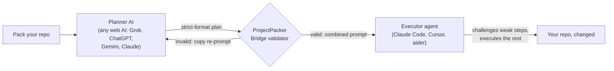

# ProjectPacker

Pack any repo into AI-ready XML — with a validated planner→executor protocol so the plan your web AI writes gets checked before your coding agent runs it.

[](https://github.com/CBaileyDev/ProjectPacker/actions/workflows/ci.yml)
[](https://github.com/CBaileyDev/ProjectPacker/releases/latest)
[](https://github.com/CBaileyDev/ProjectPacker/releases)
[](LICENSE)

<!--
hero.gif: record per docs/launch/demo-script.md (under 45 seconds).
Drop folder → live progress → result stats → copy pack → Bridge tab:
paste the malformed plan from the script → validator errors render →
paste the fixed plan → "Copy combined prompt". 1280px wide, dark theme.
Save as docs/assets/hero.gif, then replace this comment with:

-->

## Why ProjectPacker

Packing a repo into a single file for an AI is table stakes. Repomix, gitingest, and code2prompt all do it well, for free — and ProjectPacker's pack output is deliberately compatible with that ecosystem. If all you need is a pack, any of these tools works.

The unsolved problem is the handoff. You paste a pack into a web AI, it writes a confident plan, you paste that plan into a coding agent, and the agent executes it blindly — including the steps where the planner hallucinated a file, skipped a migration, or buried a destructive change in step 7. ProjectPacker inserts a contract between the two: every pack embeds a versioned protocol that forces the planner to emit a strict-format plan with a mandatory rationale for every step, a validator rejects malformed plans before they reach your agent, and the executor prompt instructs the agent to challenge any step whose rationale doesn't hold.

ProjectPacker never edits your files, runs fully offline (the only network call is the GitHub clone you explicitly ask for), sends no telemetry, and has no accounts or API keys. You bring the AIs you already pay for.

## Comparison

| | ProjectPacker | Repomix | gitingest | code2prompt |
|---|---|---|---|---|
| Desktop GUI | ✅ | ❌ (web + CLI) | ❌ (web + CLI) | ❌ (CLI) |
| XML pack output | ✅ | ✅ | ❌ (text) | ✅ (templates) |
| Token counts | ✅ 7 models, real tokenizers | ✅ | ✅ | ✅ |
| Secret scan + redaction | ✅ gitleaks ruleset | ✅ (secretlint) | ❌ | ❌ |
| Tree-sitter compression | ✅ | ✅ | ❌ | ❌ |
| **Plan protocol + validator** | **✅** | ❌ | ❌ | ❌ |
| Offline, no account | ✅ | ✅ | ✅ (CLI) | ✅ |
| CLI | ❌ (roadmap) | ✅ | ✅ | ✅ |
| MCP server | ❌ (roadmap) | ✅ | ✅ | ❌ |
| Remote/web version | ❌ | ✅ | ✅ | ❌ |

Repomix has the larger ecosystem — CLI, MCP server, website, editor integrations. If you live in the terminal, use it. ProjectPacker's lane is the desktop GUI and the protocol layer: nothing else on this list validates planner output before it reaches your executor.

## Quickstart

1. **Download** the [latest release](https://github.com/CBaileyDev/ProjectPacker/releases/latest) for your OS (Windows MSI/installer, macOS dmg, Linux AppImage/deb).
2. **Run it** and drop a folder onto the window (or paste a public GitHub URL).
3. **Pack** — watch live progress, token counts per model, and any redacted secrets.
4. **Copy** the pack and paste it into your AI of choice.

## The workflow



The pack's protocol block tells the planner exactly what shape its plan must take. The **Bridge tab** is where the contract gets enforced: paste the planner's response, and ProjectPacker validates it against the protocol grammar. A malformed plan gets you a one-click re-prompt that names every violation — paste it back to the planner and it corrects itself. A valid plan becomes a combined prompt: the plan wrapped in executor instructions that demand step-by-step verification and give the agent explicit veto power.

## The protocol

[`plan-exec-v1`](docs/protocol/plan-exec-v1.md) requires every plan to be a single Markdown document with five sections in order:

1. **Summary** — the approach, in ≤4 sentences.
2. **Risks** — open questions the executor should weigh before running anything.
3. **Steps** — each step declares an `Action` (edit/create/delete/rename/run), a `Target`, a mandatory `Rationale` (the executor uses it to decide whether to challenge), and `Details`.
4. **Verification** — how the executor proves the plan worked.
5. **Rollback** — how to undo it.

The validator rejects plans with missing or out-of-order sections, steps without rationales (or with rationales under 10 characters), invalid actions, or an empty verification list. Protocol versions are frozen on release — a pack produced today validates identically forever; improvements ship as `plan-exec-v2`.

## FAQ

**Windows says "Windows protected your PC."**
The binaries are unsigned (code-signing certificates cost more than this free tool earns). Click "More info" → "Run anyway", and verify your download first: every release asset ships with a `.sha256` file — compare with `Get-FileHash <file>` (Windows), `shasum -a 256 -c` (macOS), or `sha256sum -c` (Linux).

**macOS says the app is damaged or can't be opened.**
Same cause — unsigned. Run `xattr -cr /Applications/ProjectPacker.app` once after installing, or right-click the app → Open.

**Is this a Repomix clone?**
The packing half is intentionally compatible — same XML shape, and `.repomixignore` files are honoured (ProjectPacker's own ignore file is `.projectpackerignore`). The protocol layer is the difference: Repomix packs your repo; ProjectPacker also validates what the AI sends back.

**What does it send over the network?**
Nothing, unless you pack a GitHub URL — then it shallow-clones that repo and deletes the clone afterwards. No telemetry, no accounts, no update pings.

**Why a desktop app?**
Your code never leaves your machine, drag-and-drop beats CLI flags for this workflow, and the Bridge loop (paste → validate → re-prompt) wants a UI.

## Roadmap

- CLI (`projectpacker pack .`)
- MCP server
- Protocol plugins — executor prompt formats tuned for Cursor, aider, and others
- Auto-update
- Pack history with diffs between packs

## Development

```bash
pnpm install
pnpm tauri dev
```

Useful scripts: `pnpm bindings` (regenerate specta TypeScript bindings), `pnpm tauri build --debug --no-bundle` (build without packaging). The architecture is documented in the [design doc](docs/superpowers/specs/2026-04-30-projectpacker-design.md) — pure-Rust core (gix, tree-sitter, vendored tokenizers and gitleaks rules), Tauri 2 shell, React 19 frontend with specta-generated bindings.

## License

[MIT](LICENSE). Built by [@CBaileyDev](https://github.com/CBaileyDev).
<!-- One line about Private Code goes here once it has a public landing page. -->
